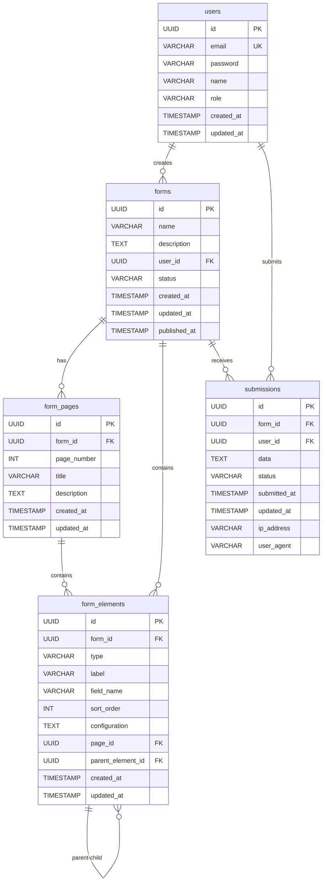

# Spring Boot Form Builder

A full-stack web application for building, managing, and rendering dynamic forms. Built with a Spring Boot backend and a React frontend.

## Features

### Form Builder
- **Click-to-Add Interface**: Add form elements (Text Input, Textarea, Number, Email, Date, Checkbox, Radio Group, Select, Element Group, Static Text) to the canvas with a single click, reorder with up/down arrows
- **Element Configuration**: Customize labels, placeholders, validation rules, and field names
- **Element Grouping**: Group related fields together; mark groups as repeatable so users can add/remove instances
- **Nested Groups**: Groups can be nested up to 5 levels deep (e.g., Line > Feature > Genes), each level repeatable independently
- **Multi-page Forms**: Create wizard-style forms with multiple pages, per-page validation, and a progress bar
- **Static Text**: Insert HTML content blocks (titles, instructions) between form fields
- **Import/Export**: Export forms as JSON and import them into other instances

### Form Management
- **Publishing**: Publish forms to make them available via a public link
- **Submissions Dashboard**: View, edit, and manage collected responses with draft/submitted status tracking
- **CSV Export**: Export submission data as CSV (admin only)

### Authentication & Authorization
- **JWT Authentication**: User registration and login with JWT-based security
- **User Roles**: Two roles with different permissions:
  - **ADMIN**: Create, edit, publish, and delete forms; view all submissions; import/export forms. The first registered user automatically becomes ADMIN.
  - **USER**: Fill published forms; view and edit own submissions only.
- **Form Ownership**: Each form belongs to the user who created it

### Database
- **PostgreSQL** for all environments (dev, test, prod) via Docker Compose
- **Flyway** migrations for schema management (V1-V7)

## Technology Stack

| Layer    | Technology                                         |
|----------|----------------------------------------------------|
| Backend  | Spring Boot 3.2, Java 17, Spring Security, JPA     |
| Frontend | React 18, TypeScript, Vite, Tailwind CSS            |
| UI       | shadcn/ui (Radix), react-hook-form, zod              |
| State    | Zustand, TanStack React Query                       |
| Database | PostgreSQL 16, Flyway                                |
| Auth     | JWT (jjwt 0.12.3), BCrypt, Method-level security    |
| Testing  | JUnit 5, Vitest, Testing Library, MSW               |
| API Docs | SpringDoc OpenAPI (Swagger UI)                       |

## Entity Relationship Diagram



## Prerequisites

- **Java 17+** (JDK)
- **Maven 3.8+**
- **Node.js 18+** and **npm**
- **Docker & Docker Compose** (required for PostgreSQL)

## Getting Started

### 1. Clone the repository

```bash
git clone <repository-url>
cd spring-boot-form-builder
```

### 2. Start PostgreSQL

```bash
docker compose up -d
```

This starts a PostgreSQL 16 instance on port 5432 with:
- Database: `formbuilder`
- Username: `formbuilder`
- Password: `formbuilder`

### 3. Start the Backend

```bash
cd server
mvn spring-boot:run -Dspring-boot.run.profiles=dev
```

The backend starts on **http://localhost:8080**.

Useful endpoints:
- **API**: http://localhost:8080/api/
- **Swagger UI**: http://localhost:8080/swagger-ui.html

### 4. Start the Frontend

```bash
cd client
npm install
npm run dev
```

The frontend starts on **http://localhost:5173** and proxies API requests to the backend.

### 5. Use the Application

1. Open **http://localhost:5173** in your browser
2. **Register** a new account (the first registered user becomes **ADMIN**)
3. **Login** with your credentials
4. **Create a form** from the dashboard (admin only)
5. **Click elements** in the palette to add them to the canvas, use arrows to reorder
6. **Configure elements** by clicking on them in the canvas (right panel)
7. **Create groups** and nest them for complex data structures
8. **Add pages** using the page tabs above the canvas for multi-page forms
9. **Preview** your form using the Preview button
10. **Publish** the form to make it available at its public URL
11. **Share** the public form link: `http://localhost:5173/f/{formId}`
12. **View submissions** from the form dashboard (admin only)

## Restarting & Network Access

To expose the application to other PCs on the local network (not just localhost):

### Restart the backend (public interface)

```bash
# Kill the existing backend process
kill $(lsof -t -i:8080) 2>/dev/null

# Start on all interfaces (0.0.0.0 instead of localhost)
cd server
mvn spring-boot:run -Dspring-boot.run.arguments="--server.address=0.0.0.0"
```

### Restart the frontend (public interface)

```bash
# Kill the existing frontend process
kill $(lsof -t -i:5173) 2>/dev/null

# Start on all interfaces
cd client
npx vite --host 0.0.0.0
```

### Access from other PCs

Find this machine's IP address:
```bash
hostname -I | awk '{print $1}'
```

Other PCs on the network can then open `http://<your-ip>:5173` in their browser.

> **Note:** The Vite dev server proxies `/api` requests to `localhost:8080`, so the backend must also be running. The backend's CORS config allows all origins by default, so LAN access works without additional configuration.

## Running with Production Profile

```bash
cd server
mvn spring-boot:run -Dspring-boot.run.profiles=prod
```

Or set the environment variable:
```bash
SPRING_PROFILES_ACTIVE=prod mvn spring-boot:run
```

### Stop PostgreSQL

```bash
docker compose down        # Stop containers (data persists in volume)
docker compose down -v     # Stop containers and delete data
```

## Running Tests

### Backend Tests

```bash
cd server
mvn test
```

Tests run against a `formbuilder_test` database on the same Docker Compose PostgreSQL instance. The test suite uses Flyway clean+migrate for isolation between runs. 18 tests covering authentication, form CRUD, publishing, submissions, role-based access control, and full-page group submissions.

### Frontend Tests

```bash
cd client
npm test          # Run all tests once
npm run test:watch  # Run in watch mode
```

53 tests across 3 test suites:
- **formBuilderStore.test.ts** (23 tests): Zustand store operations — add/remove/update/move elements, nested groups, page management, element selection
- **FormRenderer.test.tsx** (19 tests): Form rendering for all field types, required field indicators, Zod validation errors, form submission, repeatable groups, submit button states
- **FormList.test.tsx** (11 tests): Integration tests with MSW — loading state, form cards, status badges, admin vs user role-based visibility

Test stack: Vitest, Testing Library, MSW (Mock Service Worker)

## Project Structure

```
spring-boot-form-builder/
├── docker-compose.yml              # PostgreSQL container
├── server/                         # Spring Boot backend
│   ├── pom.xml
│   └── src/
│       ├── main/java/com/formbuilder/
│       │   ├── auth/               # JWT auth (User, AuthController, AuthService, JwtService)
│       │   ├── config/             # SecurityConfig (method security), WebConfig, OpenApiConfig
│       │   ├── element/            # FormElement entity, service, controller
│       │   ├── exception/          # Global exception handler
│       │   ├── form/               # Form entity, service, controller (role-aware)
│       │   ├── page/               # FormPage entity, service, controller
│       │   └── submission/         # Submission entity, service, controller (role-aware)
│       ├── main/resources/
│       │   ├── application.properties          # Shared config
│       │   ├── application-dev.properties      # Dev PostgreSQL config
│       │   ├── application-prod.properties     # Prod PostgreSQL config
│       │   └── db/migration/                   # Flyway migrations (V1-V7)
│       └── test/                               # Backend tests + TestFlywayConfig
├── client/                         # React frontend
│   ├── package.json
│   ├── vitest.config.ts            # Vitest configuration
│   └── src/
│       ├── api/                    # API client and types
│       ├── components/
│       │   ├── builder/            # FormBuilder, Canvas, ElementPalette, ConfigPanel
│       │   ├── dashboard/          # FormList, SubmissionList
│       │   ├── preview/            # FormRenderer, MultiPageFormRenderer
│       │   └── ui/                 # shadcn/ui components
│       ├── pages/                  # Route pages (Login, Register, Public form, etc.)
│       ├── stores/                 # Zustand stores (formBuilder, auth)
│       └── test/                   # Test infrastructure
│           ├── setup.ts            # jest-dom, ResizeObserver polyfill, MSW lifecycle
│           ├── mocks/              # MSW handlers and server
│           └── __tests__/          # Test files
```

## API Overview

### Public Endpoints (no auth required)
| Method | Path                                | Description           |
|--------|-------------------------------------|-----------------------|
| POST   | `/api/auth/register`                | Register a new user   |
| POST   | `/api/auth/login`                   | Login, returns JWT    |
| GET    | `/api/public/forms/{formId}`        | Get published form    |
| POST   | `/api/public/forms/{formId}/submit` | Submit form response  |

### Protected Endpoints (JWT required)
| Method | Path                                             | Description              | Role     |
|--------|--------------------------------------------------|--------------------------|----------|
| GET    | `/api/auth/me`                                   | Get current user         | Any      |
| GET    | `/api/forms`                                     | List forms               | Any      |
| POST   | `/api/forms`                                     | Create a form            | ADMIN    |
| GET    | `/api/forms/{formId}`                            | Get form details         | Any      |
| PUT    | `/api/forms/{formId}`                            | Update form              | ADMIN    |
| DELETE | `/api/forms/{formId}`                            | Delete form              | ADMIN    |
| POST   | `/api/forms/{formId}/publish`                    | Publish form             | ADMIN    |
| GET    | `/api/forms/{formId}/export`                     | Export form as JSON      | ADMIN    |
| POST   | `/api/forms/import`                              | Import form from JSON    | ADMIN    |
| GET    | `/api/forms/{formId}/elements`                   | List form elements       | Any      |
| POST   | `/api/forms/{formId}/elements`                   | Create element           | Any      |
| PUT    | `/api/forms/{formId}/elements/{elementId}`       | Update element           | Any      |
| DELETE | `/api/forms/{formId}/elements/{elementId}`       | Delete element           | Any      |
| PUT    | `/api/forms/{formId}/elements/reorder`           | Reorder elements         | Any      |
| GET    | `/api/forms/{formId}/pages`                      | List form pages          | Any      |
| POST   | `/api/forms/{formId}/pages`                      | Create page              | Any      |
| PUT    | `/api/forms/{formId}/pages/{pageId}`             | Update page              | Any      |
| DELETE | `/api/forms/{formId}/pages/{pageId}`             | Delete page              | Any      |
| PUT    | `/api/forms/{formId}/pages/reorder`              | Reorder pages            | Any      |
| GET    | `/api/forms/{formId}/submissions`                | List submissions         | Any      |
| GET    | `/api/forms/{formId}/submissions/{submissionId}` | Get submission           | Any      |
| PUT    | `/api/forms/{formId}/submissions/{submissionId}` | Update submission        | Any      |
| GET    | `/api/forms/{formId}/submissions/export`         | Export submissions (CSV) | ADMIN    |

Note: `GET /api/forms` returns all own forms for ADMIN, only published forms for USER. `GET /api/forms/{formId}/submissions` returns all submissions for ADMIN, only own submissions for USER.

## Admin Management

Promote a user to ADMIN from the command line:

```bash
cd server
mvn spring-boot:run -Dspring-boot.run.arguments="--promote-admin=user@example.com"
```

The app starts, promotes the user, and exits immediately.

## Configuration

### Environment Variables / Properties

| Property            | Default                          | Description                     |
|---------------------|----------------------------------|---------------------------------|
| `server.port`       | `8080`                           | Backend server port             |
| `spring.profiles.active` | `dev`                       | Active profile (`dev` or `prod`) |
| `jwt.secret`        | (set in application.properties)  | JWT signing key (change in prod) |
| `jwt.expiration`    | `86400000`                       | JWT token lifetime (ms, default 24h) |

### Changing the JWT Secret (recommended for production)

Set the `jwt.secret` property via environment variable:
```bash
JWT_SECRET=your-secure-random-key mvn spring-boot:run -Dspring-boot.run.profiles=prod
```
